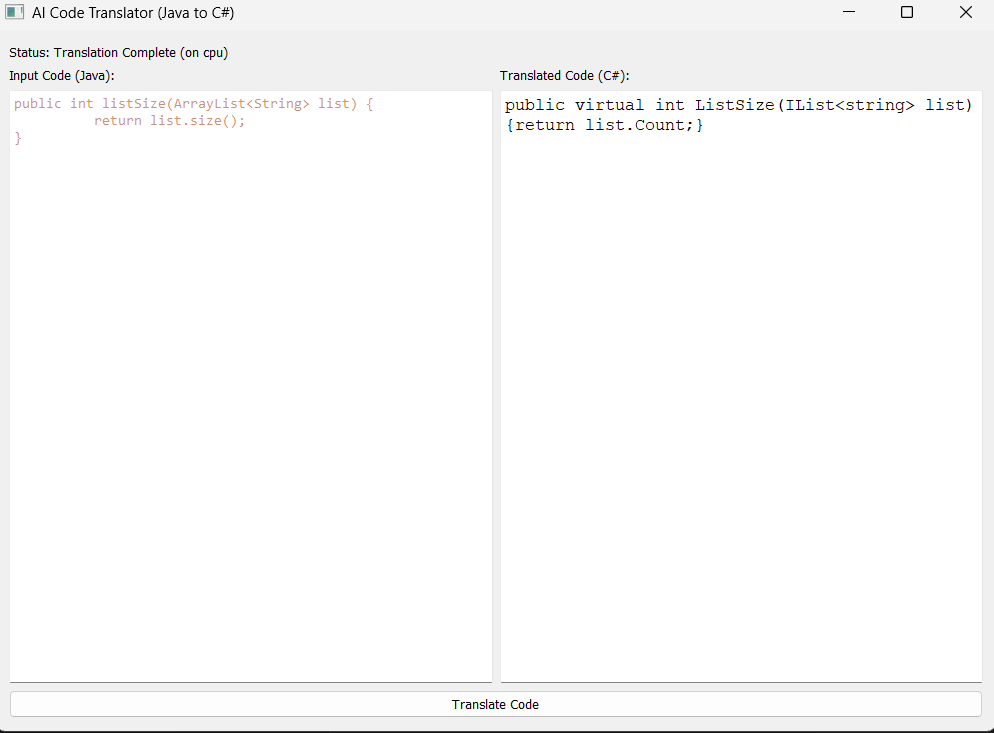

# Java to C# Code Translator

A desktop application that uses a fine-tuned CodeT5 model to automatically translate Java source code into C#.
Built with PyQt5 for the interface and HuggingFace Transformers for model inference.



## Model

The translation model is a fine-tuned version of CodeT5, trained on Java/C# code pairs.
Model hosted on HuggingFace: [vipinchaudhry/codet5-java-to-csharp-translation](https://huggingface.co/vipinchaudhry/codet5-java-to-csharp-translation/tree/main)

The model is downloaded automatically on first run and cached locally — no manual setup needed.

## Dataset

Trained on the [CodeXGLUE Code-to-Code Translation dataset](https://huggingface.co/datasets/google/code_x_glue_cc_code_to_code_trans) by Google, which contains paired Java and C# code samples.

## Installation
```bash
pip install torch transformers PyQt5 sentencepiece protobuf
```

## Usage
```bash
python app.py
```

Paste your Java code into the left panel and click **Translate Code**. The C# translation will appear on the right.

Note: The first run will take a few minutes to download the model (~900MB). Subsequent runs will load instantly from cache.

## Built With

- Python
- PyTorch
- HuggingFace Transformers
- PyQt5
- Google Colab (for training)
