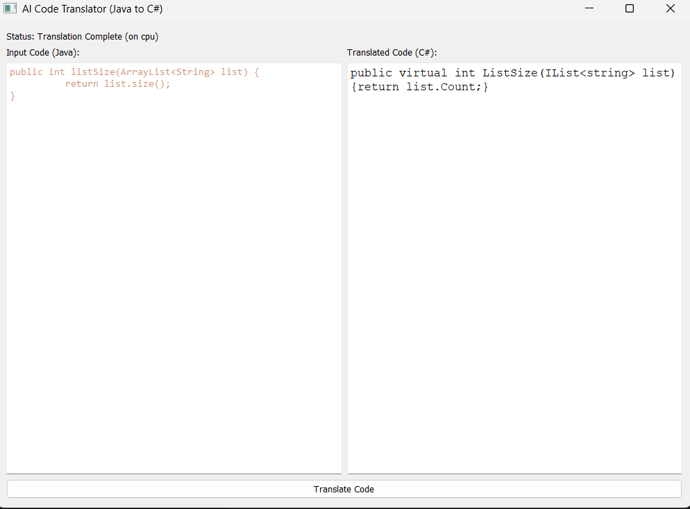

<div align="center">

# Java → C# Code Translator

**Paste Java. Click a button. Get C#.**

A desktop app powered by a fine-tuned AI model that automatically translates Java source code into C# — no internet connection, no API key, no setup beyond the first run.

---



[](https://huggingface.co/vipinchaudhry/codet5-java-to-csharp-translation)


</div>

---

## Table of Contents

- [About the Project](#about-the-project)
- [Highlights](#highlights)
- [Built With](#built-with)
- [Quickstart](#quickstart)
- [Usage](#usage)
- [Examples](#examples)
- [Model and Training](#model-and-training)
- [Limitations](#limitations)
- [License](#license)
- [Contact](#contact)

---

## About the Project

Migrating a Java codebase to C# is a tedious, error-prone process. While the two languages share similar syntax and structure, there are enough differences — naming conventions, type systems, standard library calls — that manual translation is slow and frustrating.

This app uses a fine-tuned [CodeT5](https://huggingface.co/Salesforce/codet5-base) model trained on the [CodeXGLUE Code-to-Code Translation dataset](https://huggingface.co/datasets/google/code_x_glue_cc_code_to_code_trans) by Google, which contains thousands of paired Java and C# code samples. The model learns the structural and syntactic patterns that map between the two languages — and serves them through a clean two-panel desktop UI.

It's useful for developers working with legacy Java codebases, or anyone learning the differences between the two languages.

---

## Highlights

- **No API key or internet connection needed after first run** — model is downloaded once and cached locally
- **Handles real syntax differences** — converts `ArrayList` to `IList`, `System.out.println` to `Console.WriteLine`, and more
- **Simple two-panel UI** — paste Java on the left, get C# on the right
- **Runs on CPU** — no GPU required

---

## Built With

[](https://python.org)
[](https://pytorch.org)
[](https://huggingface.co/docs/transformers)
[](https://pypi.org/project/PyQt5/)
[](https://huggingface.co/Salesforce/codet5-base)
[](https://colab.research.google.com)

---

## Quickstart

**1. Clone the repository**
```bash
git clone https://github.com/vipinchaudhry/Java-to-CSharp-Translation-App.git
cd Java-to-CSharp-Translation-App
```

**2. Install dependencies**
```bash
pip install torch transformers PyQt5 sentencepiece protobuf
```

**3. Run the app**
```bash
python app.py
```

> **Note:** The first run will download the fine-tuned model (~900MB) and cache it locally. Subsequent runs load instantly from cache.

Requires Python 3.8+. Developed and tested on Windows.

---

## Usage

Paste your Java code into the left panel and click **Translate Code**. The C# translation appears on the right.

The app works best on **single methods** rather than entire class files. Input should be valid Java — entering plain text or non-code may produce nonsensical output or cause the app to hang.

---

## Examples

Each example shows the Java input alongside the expected and actual model output.

---

**Example 1 — Simple method**

```java
// Java input
public String getProcessName(int id) {
    return "Process_" + id;
}
```

```csharp
// Expected output
public string GetProcessName(int id) {
    return "Process_" + id;
}

// Actual model output
public virtual string GetProcessName(int id) {
    return "Process_" + id;
}
```

---

**Example 2 — Type conversion**

```java
// Java input
public int listSize(ArrayList<String> list) {
    return list.size();
}
```

```csharp
// Expected output
public int ListSize(List<string> list) {
    return list.Count;
}

// Actual model output
public virtual int ListSize(IList<string> list) {
    return list.Count;
}
```

---

**Example 3 — Exception handling**

```java
// Java input
public void readFile(String path) {
    try {
        System.out.println("Opening: " + path);
    } catch (Exception e) {
        System.out.println("Error: " + e.getMessage());
    } finally {
        System.out.println("Done.");
    }
}
```

```csharp
// Expected output
public void ReadFile(string path) {
    try {
        Console.WriteLine("Opening: " + path);
    } catch (Exception e) {
        Console.WriteLine("Error: " + e.Message);
    } finally {
        Console.WriteLine("Done.");
    }
}

// Actual model output — note System.Out.WriteLine instead of Console.WriteLine
public virtual void ReadFile(string path) {
    try {
        System.Out.WriteLine("Opening: " + path);
    } catch (Exception e) {
        System.Out.WriteLine("Error: " + e.Message);
    } finally {
        System.Out.WriteLine("Done.");
    }
}
```

---

## Model and Training

The app uses a fine-tuned version of [CodeT5](https://huggingface.co/Salesforce/codet5-base) by Salesforce — a pre-trained encoder-decoder model designed specifically for code understanding and generation tasks.

**Fine-tuning details:**
- Dataset: [CodeXGLUE Code-to-Code Translation](https://huggingface.co/datasets/google/code_x_glue_cc_code_to_code_trans) by Google
- Hardware: T4 GPU via Google Colab
- Training: 5 epochs · ~1h 50min · 3,220 steps

**Fine-tuned model on Hugging Face:**
[vipinchaudhry/codet5-java-to-csharp-translation](https://huggingface.co/vipinchaudhry/codet5-java-to-csharp-translation)

---

## Limitations

This is a small fine-tuned model — it performs well on common patterns but has known shortcomings:

- Occasionally produces `System.Console.WriteLine` instead of `Console.WriteLine`
- May miss closing brackets on longer or more complex methods
- Works best on single methods rather than entire class files
- Output may need minor formatting cleanup
- Input must be valid Java — plain text or non-code input produces nonsensical output

---

## License

Distributed under the MIT License. See [`LICENSE`](LICENSE) for more information.

---

## Contact

**Vipin Chaudhry**

[](https://github.com/vipinchaudhry)
[](https://www.linkedin.com/in/vipin-chaudhry-616b54403/)
[](https://huggingface.co/vipinchaudhry)

<div align="right"><a href="#java--c-code-translator">↑ back to top</a></div>
